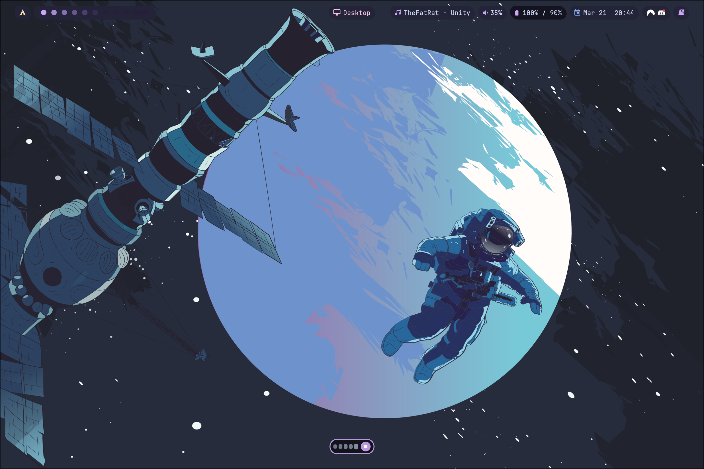

<p align="center">
  
</p>

<h1 align="center">Pillbox</h1>

<p align="center">
  A Hyprland-native voice dictation frontend powered by
  <a href="https://github.com/ggml-org/whisper.cpp">whisper.cpp</a>
</p>

---

<p align="center">
  
</p>

<details>
<summary>Full screen example</summary>
<p align="center">
  
</p>
</details>

## What is this?

Pillbox is a dictation frontend for Hyprland that integrates [whisper.cpp](https://github.com/ggml-org/whisper.cpp) with a themed pill overlay. It handles the glue between audio capture, the whisper transcription server, and typing the result into your focused window — so you get a dictation experience similar to macOS or Android, but running entirely on your own hardware.

**Pillbox provides:**
- A pill-shaped Wayland overlay (via GTK4 + layer-shell) with live waveform
- Auto-theming from your Hyprland color config
- Silence detection and hotkey toggle
- An interactive installer that sets up whisper.cpp for you

**Pillbox relies on:**
- [whisper.cpp](https://github.com/ggml-org/whisper.cpp) for speech recognition (OpenAI's Whisper model, pinned to v1.8.4)
- [PipeWire](https://pipewire.org/) for audio capture
- [wtype](https://github.com/atx/wtype) for typing into Wayland windows
- [GTK4](https://gtk.org/) + [gtk4-layer-shell](https://github.com/wmww/gtk4-layer-shell) for the overlay

**How it works:**
1. Press a hotkey — a small pill overlay appears at the bottom of your screen
2. Speak — the pill shows a live waveform
3. Stop speaking — after 3 seconds of silence, your audio is sent to a local whisper.cpp server for transcription, and the result is typed into whatever window is focused
4. Press the hotkey again to dismiss early

No cloud services, no subscriptions, no data leaves your machine. By default, the server binds to `127.0.0.1` — nothing is exposed to your network unless you explicitly opt in. The pill auto-themes from your Hyprland colors so it matches your rice out of the box.

## Install

```bash
git clone https://github.com/HonorCodes/pillbox.git
cd pillbox
./install.sh
```

The interactive installer handles everything:
- Checks dependencies (and tells you exactly what to install for your distro)
- Installs Pillbox to `~/.local/bin/`
- Sets up the whisper transcription server with your choice of model
- Adds a Hyprland keybinding

**That's it.** The installer walks you through each step.

## Models & Hardware

Pillbox uses OpenAI's Whisper speech recognition model via [whisper.cpp](https://github.com/ggml-org/whisper.cpp). You choose a model size during install — bigger models are more accurate but need more resources.

| Model | Download | VRAM / RAM | Inference | Accuracy | Recommended for |
|-------|----------|-----------|-----------|----------|-----------------|
| `tiny.en` | 75 MB | ~400 MB | ~0.1s | Basic | Raspberry Pi, older hardware, quick notes |
| `base.en` | 148 MB | ~500 MB | ~0.3s | Good | Any modern CPU, daily use without GPU |
| `small.en` | 488 MB | ~1 GB | ~0.8s | Great | Mid-range CPU (i5/Ryzen 5+) |
| `large-v3-turbo` | 1.5 GB | ~3 GB | ~0.5s (GPU) | Best | **NVIDIA GPU recommended** (GTX 1060+) |

**Inference times** are approximate for a 5-second audio clip. GPU times assume NVIDIA with CUDA.

**Recommendations:**
- **No GPU?** Use `base.en` — fast enough on any modern CPU (i5/Ryzen 5 or better)
- **NVIDIA GPU?** Use `large-v3-turbo` — best accuracy, runs fast with CUDA
- **No NVIDIA GPU?** Use `base.en` or `small.en` on CPU — the server currently builds with CUDA or CPU only
- **Laptop / battery life matters?** Use `tiny.en` or `base.en` to minimize power draw

The `.en` models are English-only and more accurate for English. For other languages, use `large-v3-turbo` and set `--language=auto` during server setup.

The installer auto-detects your GPU and suggests the right model.

## Usage

| Action | What happens |
|--------|-------------|
| Press hotkey | Pill appears, recording starts |
| Speak | Waveform animates |
| Stop speaking (3s) | Auto-stops, transcribes, types text |
| Press hotkey again | Instant dismiss, transcribes what you said |
| Click stop button | Same as pressing hotkey again |

Text is also copied to your clipboard automatically.

## Configuration

Edit `~/.config/pillbox/pillbox.conf` (created by the installer). All settings use Hyprland-style `key = value` syntax.

### Server

```conf
server_url = http://localhost:9310
```

### Behavior

```conf
silence_threshold = -20    # dB — raise for noisy rooms, lower for quiet mics
silence_duration = 3.0     # seconds of silence before auto-stop
```

### Position & Size

```conf
# Where the pill appears on screen
#   top-left      top-center      top-right
#   center-left   center          center-right
#   bottom-left   bottom-center   bottom-right
position = bottom-center

# Margin from the nearest screen edge (pixels)
# Auto-detected from Hyprland's gaps_out if not set
# margin = 30

# Pill dimensions
width = 90
height = 32
num_bars = 5
```

### Opacity

Each element's transparency can be tuned independently. Range: `0.0` (invisible) to `1.0` (solid).

```conf
opacity_background = 0.75    # pill body
opacity_border = 0.9         # border outline
opacity_button = 0.9         # stop button
opacity_waveform = 0.85      # waveform bars (scales with audio level)
```

### Colors

Colors are auto-detected from your Hyprland theme (see Theming below). To override manually:

```conf
# 6-digit hex (no #)
background = 1a1b26
foreground = c0caf5
border = 7aa2f7
```

All [Hyprland color formats](https://wiki.hyprland.org/Configuring/Variables/#colors) are supported: `rgb()`, `rgba()`, `0xAARRGGBB`, `#hex`, and 3-char shorthand.

The full config reference with all defaults is in [`pillbox.conf.example`](pillbox.conf.example).

## Theming

Pillbox auto-detects your Hyprland color theme from:
- `~/.config/theme/colors.conf`
- `~/.config/hypr/colors.conf`

It reads `$variable = hexvalue` definitions and maps them:

| Theme variable | Pillbox element | Fallback |
|---|---|---|
| `$base` or `$surface` | Pill background | `0a0a0f` |
| `$text` | Waveform bars | `cdd6f4` |
| `$mauve` or `$lavender` | Border + stop button | `cba6f7` |

**Auto-contrast:** Waveform bars are light on dark backgrounds, dark on light. The stop button icon (square) switches between white and black based on the border color's luminance.

**Override priority:** `pillbox.conf` overrides > Hyprland theme > built-in fallbacks.

If no theme is found, Pillbox uses a dark glassmorphic default that works on most setups. Set `theme_source` in your config to point to a specific file:

```conf
theme_source = ~/.config/theme/colors.conf
```

## Remote Server

By default, the server binds to `127.0.0.1` (localhost only). If you want to run the server on a separate, more powerful machine:

```bash
# On the server (--bind exposes to LAN):
sudo ./setup-server.sh --model=large-v3-turbo --bind=0.0.0.0

# On your machine, edit config:
# ~/.config/pillbox/pillbox.conf
server_url = http://your-server-ip:9310
```

This gives you the accuracy of the large model without using your host's GPU. The installer asks about LAN binding during setup.

## Troubleshooting

**Pill doesn't appear:**
- Is `gtk4-layer-shell` installed? The toggle script will show a notification if it can't find it.
- Try running manually: `~/.local/bin/pillbox-toggle.sh` — check terminal for errors.
- Verify your Hyprland config has the keybinding: `grep pillbox ~/.config/hypr/hyprland.conf`

**Waveform is flat / no audio:**
- Check your default PipeWire source: `wpctl status | grep -A3 Sources`
- Make sure the correct microphone is set as default: `wpctl set-default <id>`
- Test recording manually: `pw-record --rate 16000 --channels 1 --format s16 /tmp/test.wav` then play it back

**Server not reachable / no transcription:**
- Is whisper-server running? `systemctl status whisper-server`
- Test the API directly: `curl -F "file=@test.wav" http://localhost:9310/inference`
- Check server logs: `journalctl -u whisper-server -n 20`

**Text doesn't appear in focused window:**
- `wtype` requires the target window to accept Wayland text input. Some Electron apps may block it — check your clipboard instead (`wl-paste`).
- Try a simple test: `wtype "hello"` in a terminal — does it type?

**Missing Python/GStreamer bindings:**
- If you see `gi.require_version` errors, install the GI typelib packages for your distro.
- Arch: `sudo pacman -S python-gobject gtk4 gtk4-layer-shell gst-plugins-good`
- Ubuntu: `sudo apt install python3-gi gir1.2-gtk-4.0 gir1.2-gtk4layershell-1.0 gstreamer1.0-plugins-good`

## Uninstall

```bash
rm ~/.local/bin/pillbox.py ~/.local/bin/pillbox-toggle.sh
rm -r ~/.config/pillbox/
# Remove the keybinding lines from ~/.config/hypr/hyprland.conf
# If you set up the server:
sudo systemctl disable --now whisper-server
```

## License

MIT
